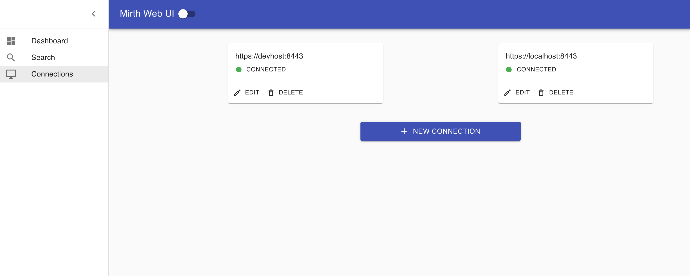
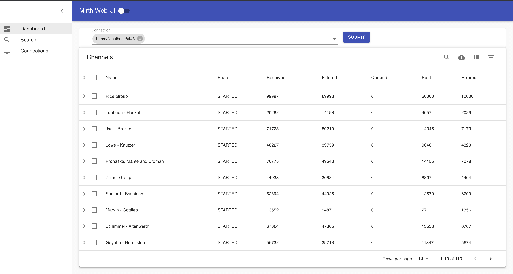
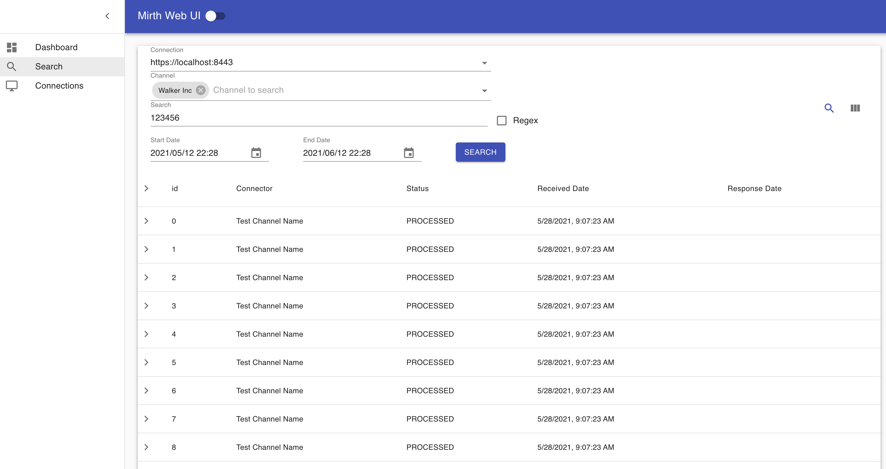
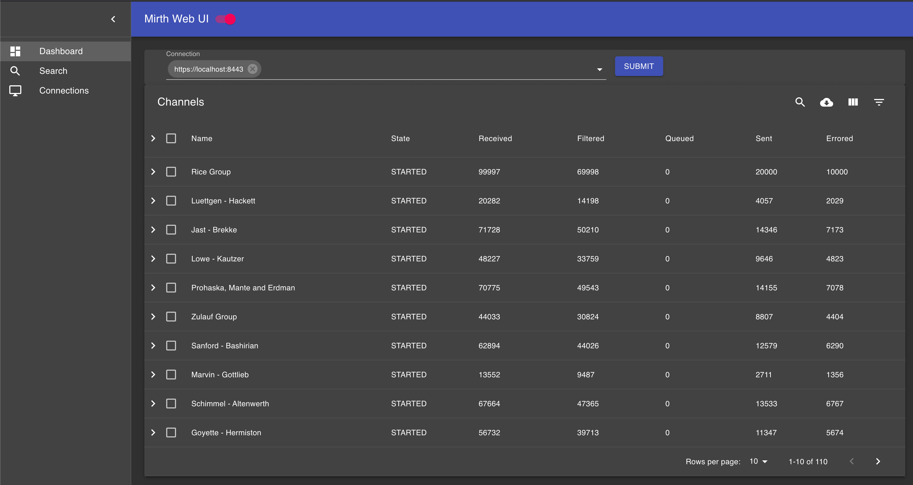

**Prerequisite:**

 You need to have nodejs v11 or greater installed. https://nodejs.org/en/

**Demo:**

https://mirthwebui.netlify.app/

**Installation:**

To run it locally, 
1. git clone https://github.com/ramsundark5/mirth-web-ui.git
2. cd mirth-web-ui
3. npm install
4. npm start
5. Open http://localhost:5000 to see the app home page.

For production deployments:
1. npm install pm2@latest -g
2. Run step 1 to 3 from local deployment step
3. npm run prod 
4. Open http://localhost:5000 to see the app home page.

**Updating an existing production app:**
1. cd into the folder where mirth-web-ui is installed
2. npm run update

**Features:**

- [x] Add/manage mirth connections
- [x] Channel status/statistics (Dashboard view)
- [x] Search Messages across channels
- [x] start/stop channels
- [ ] View channel code

**Screenshots:**

***Add/Manage Connections:***

***Dashboard(Channel statuses):***

***Message Search:***

***Dark Mode:***

